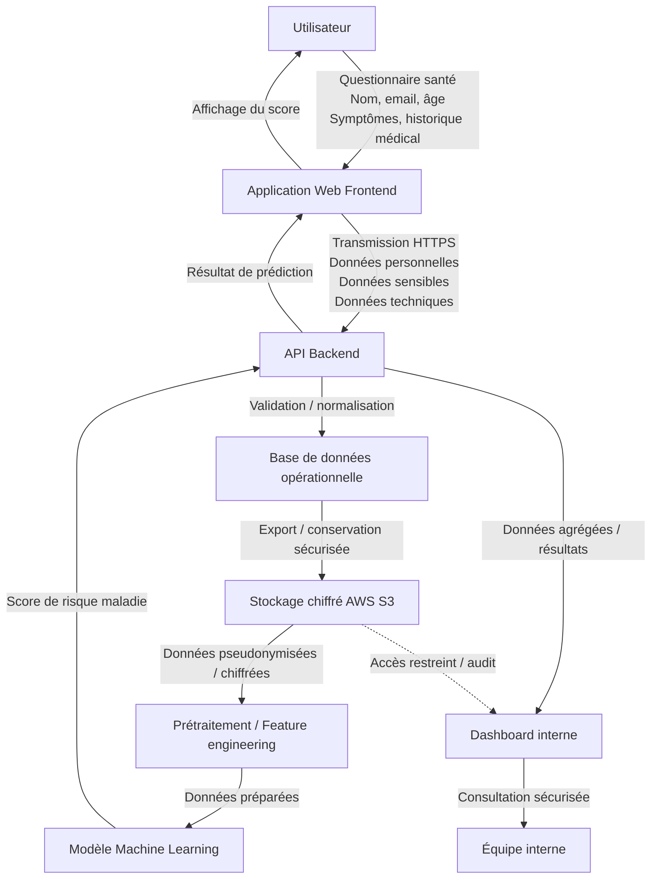

# Cartographie des flux de données — HealthPredict

## Schéma des flux de données

## Liste des données classifiées — HealthPredict

### Tableau de classification

| Donnée | Catégorie | Sensibilité | Source | Usage | Conservation |
|--------|----------|------------|--------|-------|-------------|
| Nom | Donnée personnelle | Moyen | Utilisateur (formulaire) | Identification | Compte actif |
| Email | Donnée personnelle | Moyen | Utilisateur | Contact / authentification | Compte actif |
| Âge | Donnée personnelle | Moyen | Utilisateur | Analyse statistique / ML | Compte actif |
| Symptômes | Donnée sensible (santé) | Élevé | Questionnaire santé | Prédiction ML | Limitée / sécurisée |
| Historique médical | Donnée sensible (santé) | Élevé | Questionnaire santé | Prédiction ML | Limitée / sécurisée |
| Adresse IP | Donnée technique | Moyen | Automatique | Sécurité / logs | Court terme |
| Logs applicatifs | Donnée technique | Faible à moyen | Système | Debug / monitoring | Court terme |
| Données de navigation | Donnée technique | Moyen | Cookies / tracking | Analyse usage | Limité |

---

### Synthèse

- **Données personnelles** : nom, email, âge  
- **Données sensibles** : symptômes, historique médical ⚠️  
- **Données techniques** : IP, logs, navigation  

Les données de santé sont considérées comme **hautement sensibles (RGPD)** et nécessitent des mesures de protection renforcées.

## 👥 Identification des acteurs du traitement

### 🧩 Tableau des acteurs

| Acteur | Type | Rôle | Données concernées | Localisation |
|--------|------|------|--------------------|--------------|
| HealthPredict | Responsable de traitement | Définit les finalités (prédiction des risques de maladies) et les moyens | Toutes les données | UE (supposé) |
| Amazon Web Services (AWS) | Sous-traitant | Hébergement et stockage des données (S3) | Données personnelles, sensibles, techniques | UE / hors UE |
| Équipe interne (data, produit) | Destinataire interne | Analyse des données, exploitation via dashboard | Données pseudonymisées / résultats | UE |
| Utilisateurs | Personnes concernées | Fournissent les données via l’application | Données personnelles et sensibles | Variable |

---

###  Des rôles

- **Responsable de traitement**  
  HealthPredict détermine :
  - pourquoi les données sont utilisées afin de prédire pour la santé
  - comment elles sont traitées avec architecture, ML, stockage des données

- **Sous-traitant**  
  - stockage sécurisé des données  
  - infrastructure cloud  

- **Destinataires internes**  
  Les équipes internes accèdent aux données via le dashboard :
  - analyse  
  - suivi des résultats  
  - amélioration du modèle 
  - data scientist 

- **Personnes concernées**  
  Les utilisateurs :
  - saisissent leurs données  
  - reçoivent les résultats 
  
  Les équipes d'interne : 
  - Product Owner 
  - Data Eng 
  - Data Steward
  - Business Analyst 

---

### Points de vigilance RGPD

- Accès strictement limité aux données sensibles  
- Encadrement contractuel avec le sous-traitant (AWS)  
- Vérification des transferts de données hors UE  
- Mise en place de mesures de sécurité (chiffrement, pseudonymisation)
